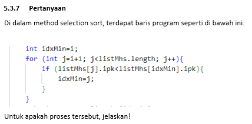

#   Percobaan 1

##  Soal
1. Jelaskan fungsi kode program berikut

    ```java
        if (data[j - 1] > data[j]) {
            temp = data[j];
            data[j] = data[j - 1];
            data[j - 1] = temp;
        }
    ```

2. Tunjukkan kode program yang merupakan algoritma pencarian nilai minimum pada selection sort!
3. Pada Insertion sort , jelaskan maksud dari kondisi pada perulangan  
4. Pada Insertion sort, apakah tujuan dari perintah 
---

##  Jawaban

1.  Fungsi Kode Program (Swap): Potongan kode tersebut berfungsi untuk menukar posisi dua elemen dalam array jika elemen sebelumnya lebih besar dari elemen saat ini (proses Swapping).
2.  berikut code nya

    ```java
        int min = i;
        for (int j = i + 1; j < jumData; j++) {
            if (data[j] < data[min]) {
                min = j;
            }
        }
    ```
3.  Kondisi while pada Insertion Sort: Kondisi j >= 0 && data[j] > temp berarti perulangan terus berjalan selama indeks j belum mencapai batas awal array DAN elemen pada data[j] masih lebih besar dari nilai yang sedang diurutkan (temp).
4.  Tujuan data[j+1] = temp: Perintah ini bertujuan untuk menempatkan nilai temp ke posisi yang tepat (posisi yang seharusnya) setelah elemen-elemen lain yang lebih besar telah digeser ke kanan.

---

#   Percobaan 2

## Soal
1.	Perhatikan perulangan di dalam bubbleSort() di bawah ini:
    ```java
        for (int i = 0; i < listMhs.length - 1; i++) {
            for (int j = 1; j < listMhs.length - i; j++) {
    ```
    a.	Mengapa syarat dari perulangan i adalah i<listMhs.length-1 ?
    b.	Mengapa syarat dari perulangan j adalah j<listMhs.length-i ?
    c.	Jika banyak data di dalam listMhs adalah 50, maka berapakali perulangan i  akan berlangsung? Dan ada berapa Tahap bubble sort yang ditempuh?
2.	Modifikasi program diatas dimana data mahasiswa bersifat dinamis (input dari keyborad) yang terdiri dari nim, nama, kelas, dan ipk!

---

## Jawaban

1.  - a. Dalam algoritma Bubble Sort, untuk mengurutkan $n$ elemen, kita hanya membutuhkan maksimal $n-1$ tahap (pass). Hal ini dikarenakan setelah $n-1$ elemen berada di posisi yang benar, elemen terakhir secara otomatis akan menempati posisi yang tersisa dengan benar pula.
    - b. Syarat ini digunakan untuk efisiensi. Pada setiap tahap i, satu elemen (terbesar atau terkecil) sudah dipastikan "tenggelam" atau berpindah ke posisi akhirnya di ujung array. Dengan mengurangi i, kita menghindari pengecekan ulang terhadap elemen-elemen yang sudah terurut di bagian belakang tersebut.
    - c. Jika terdapat 50 data di dalam listMhs, maka:
         - Perulangan i akan berlangsung sebanyak 49 kali (indeks 0 hingga 48).
         - Tahap (pass) bubble sort yang ditempuh adalah 49 tahap.
2.  berikut codenya

    ```java
        for (int i = 0; i < jmlMhs; i++) {
            System.out.println("Masukkan Data Mahasiswa ke-" + (i + 1));
            System.out.print("NIM   : ");
            String nim = s1.nextLine();
            System.out.print("Nama  : ");
            String nama = s1.nextLine();
            System.out.print("Kelas : ");
            String kelas = s1.nextLine();
            System.out.print("IPK   : ");
            double ipk = s.nextDouble();

            Mahasiswa23 m = new Mahasiswa23(nim, nama, kelas, ipk);
            list.tambah(m);
            System.out.println("-----------------------------");
        }        
    ```

---

#   Percobaan 3

##   Soal
1.  
---
##   Jawaban
1.  Proses tersebut merupakan bagian inti dari algoritma Selection Sort yang berfungsi untuk mencari nilai terkecil dalam deretan data yang belum terurut. Pada awal setiap tahapan, variabel idxMin diisi dengan indeks i sebagai asumsi sementara bahwa elemen tersebut adalah yang paling kecil. Program kemudian melakukan penelusuran menggunakan perulangan j untuk membandingkan IPK pada setiap posisi setelah i dengan nilai IPK yang ada pada posisi idxMin. Jika ditemukan objek mahasiswa dengan IPK yang lebih rendah, maka posisi idxMin akan diperbarui dengan indeks j yang baru. Setelah seluruh elemen dalam satu putaran selesai diperiksa, variabel idxMin akan menyimpan lokasi data dengan nilai paling minimum untuk kemudian ditukar ke posisi depan agar urutan data menjadi meningkat.
---

#   Percobaan 4

##   Soal

1.  Ubahlah fungsi pada InsertionSort sehingga fungsi ini dapat melaksanakan proses sorting dengan cara descending.

---
##   Jawaban

1. berikut perubahannya

    ```java
        void insertionSort() { // DESC
            for (int i = 1; i < listMhs.length; i++) {
                Mahasiswa23 temp = listMhs[i];
                int j = i;
                while (j > 0 && listMhs[j - 1].ipk < temp.ipk) {
                    listMhs[j] = listMhs[j - 1];
                    j--;
                }
                listMhs[j] = temp;
            }
        }        
    ```
 
---